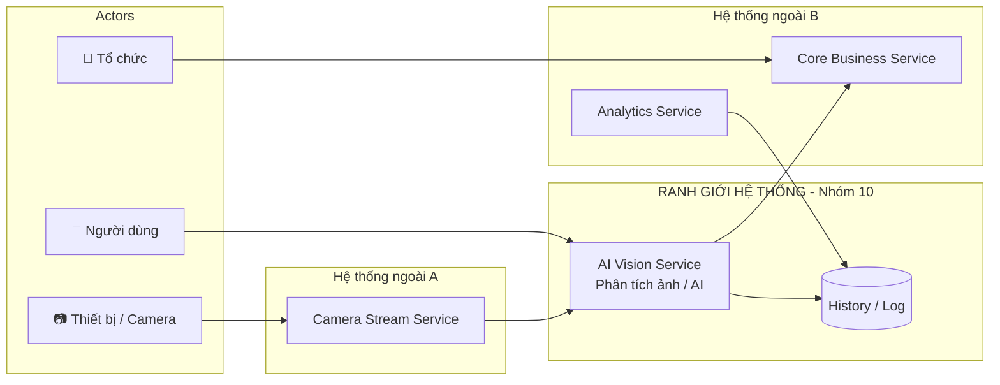
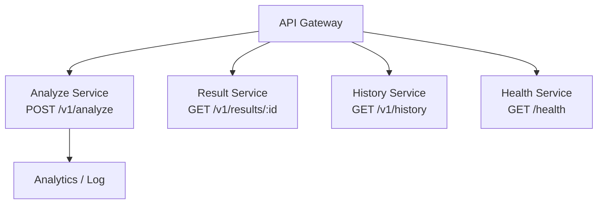
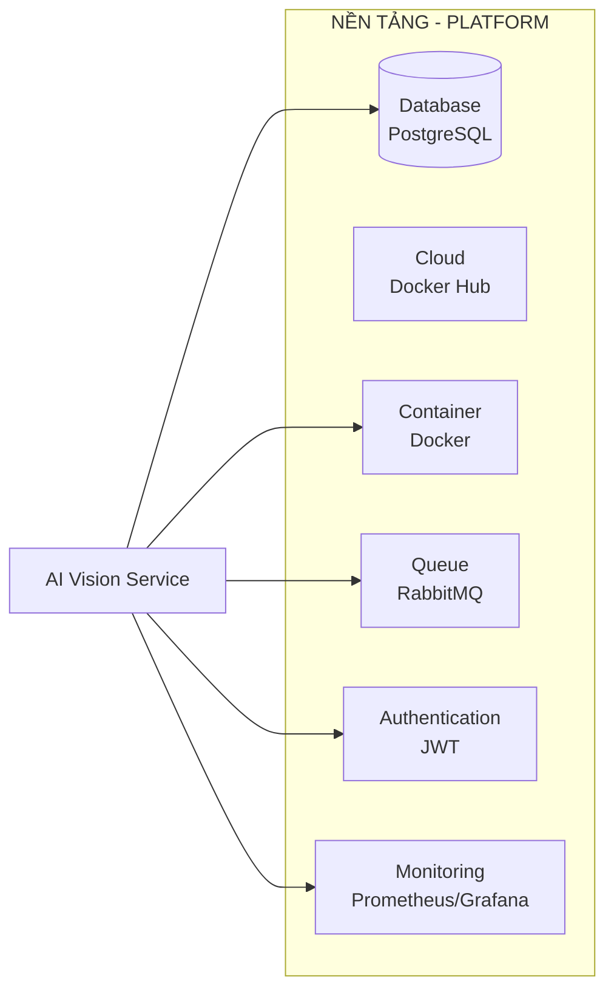

# Service Boundary Diagram - Nhóm 10

## 1. Actor — Ai tương tác với sản phẩm?

| Actor | Mô tả |
|---|---|
| Người dùng | Quản trị viên, bảo vệ xem kết quả phân tích camera |
| Thiết bị | Camera IP gửi ảnh/frame vào hệ thống |
| Hệ thống ngoài | Camera Stream Service gửi dữ liệu ảnh |
| Tổ chức | Ban quản lý campus nhận cảnh báo từ Core Business Service |

---

## 2. Boundary — Nhóm mình xây phần nào?

### Ranh giới hệ thống

**Trong ranh giới (nhóm kiểm soát, xây dựng):**
- Nhận ảnh/frame từ Camera Stream Service
- Xác thực và kiểm tra dữ liệu đầu vào
- Phân tích ảnh bằng AI (YOLOv8 / mock AI)
- Trả về kết quả phát hiện có cấu trúc
- Lưu lịch sử phân tích

**Ngoài ranh giới (chỉ tích hợp):**
- Camera Stream Service (upstream)
- Core Business Service (nhận kết quả bất thường)
- Analytics Service (đọc lịch sử)

---

## 3. Service — Bên trong có những khả năng nào?

### Hệ thống (API Gateway + Services)

| Method | Endpoint | Chức năng |
|---|---|---|
| GET | /health | Kiểm tra service còn sống |
| POST | /v1/analyze | Nhận ảnh, chạy AI, trả kết quả |
| GET | /v1/results/{request_id} | Tra cứu kết quả theo request |
| GET | /v1/history | Xem lịch sử phân tích gần nhất |

### Input
- `camera_id`: mã camera
- `image_url`: đường dẫn ảnh/frame
- `timestamp`: thời điểm ghi nhận
- `request_id`: mã yêu cầu

### Output
- `detected`: có phát hiện đối tượng không
- `object`: đối tượng phát hiện (person, unknown...)
- `confidence`: độ tin cậy
- `risk_level`: mức rủi ro gợi ý
- `message`: mô tả ngắn kết quả

---

## 4. Platform — Service chạy trên nền tảng nào?

| Thành phần | Công nghệ |
|---|---|
| API Gateway | Traefik v3.1 |
| AI Runtime | Python 3.11 + YOLOv8 (ultralytics) |
| Database | PostgreSQL 15 |
| Queue | RabbitMQ 3 |
| Cache | Redis 7 |
| Container | Docker + Docker Compose |
| Monitoring | Prometheus + Grafana |
| Authentication | JWT |

---

## 5. Cặp phụ thuộc (Consumer / Provider)

| Consumer | Provider | Điểm giao tiếp |
|---|---|---|
| AI Vision Service | Camera Stream Service | Nhận ảnh qua HTTP POST |
| Core Business Service | AI Vision Service | Nhận kết quả phân tích qua HTTP |
| Analytics Service | AI Vision Service | Đọc lịch sử qua GET /v1/history |
| AI Vision Service | PostgreSQL | Lưu/đọc lịch sử phân tích |
| AI Vision Service | RabbitMQ | Đẩy event bất thường |

## Additional Links
- [Code](https://github.com/FIT-17-09/lab1-setup-ldung12)
- [Issues](https://github.com/FIT-17-09/lab1-setup-ldung12/issues)
- [Pull requests](https://github.com/FIT-17-09/lab1-setup-ldung12/pulls)
- [Actions](https://github.com/FIT-17-09/lab1-setup-ldung12/actions)
- [lab1-setup-ldung12](https://github.com/FIT-17-09/lab1-setup-ldung12/tree/main)
- [evidence](https://github.com/FIT-17-09/lab1-setup-ldung12/tree/main/evidence)
- [buoi-01](https://github.com/FIT-17-09/lab1-setup-ldung12/tree/main/evidence/buoi-01)
